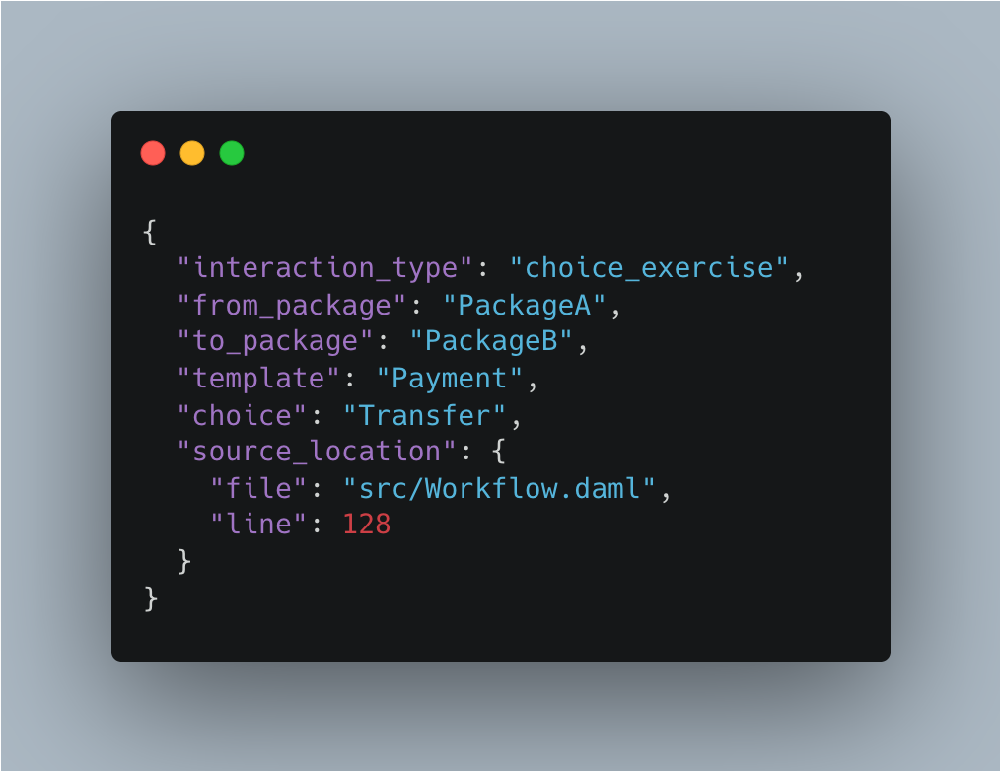
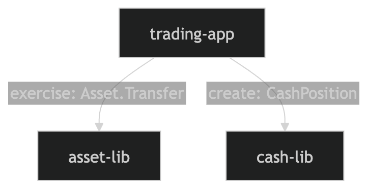

# Development Fund Proposal

**Author**: Certora  
**Status**: Draft  
**Created**: 2026-03-19

---

# Abstract

We propose a lightweight static analysis tool that inspects a Daml project to compute and present information about cross-package interactions in a developer-friendly way. Unexpected references across packages can increase the risk of misuse of sensitive functionality and broaden the attack surface. Being able to precisely compute the dependencies gives users a way to inspect it statically and redesign the system if needed.

---

# Specification

## 1. Objective

As it stands today, Daml security researchers, developers, and node operators who vet packages must manually analyze packages used in a Daml project to understand how they might interact. This leads to longer security reviews and development time. For example, if package `A` can exercise choices or create templates from package `B` , it might give `A` control over money movement, approvals, etc. which may be undesirable. Examples of behavior that the tool should prevent:  
1. A `.dalf` cannot be used to steal assets  
2. A `.dalf` does not negatively affect any app from another provider

We propose a tool to statically analyze a Daml project and produce a visual output that will show the various ways packages can interact with each other.  The output will also be available as a JSON file so that other tools can leverage its output, similar to the [graphviz](https://graphviz.org/) tool.

The goal is to help auditors and other users analyze a `.dalf` and precisely identify all places in the source code where a package has the authority to call into another package, including the relevant source file and line number for each interaction. This analysis will be for the entire dependency tree or to a pre-specified depth. This will help the auditor focus on the most security critical areas that may inadvertently delegate authority.

## 2. Implementation Mechanics

The input to the tool will be a project’s compiled `.dar` which contains the main package, its source code, and its dependencies. To a first approximation, the tool will:  

1. Inspect the `.dar` file and identify all the packages used  
2. For every package, identify every location where the code exercises choices defined on a template or interface from another package.  
3. Additionally, report cross-package template usage as a sign of dependency.  
4. For each such interaction, report:  
  - the source file path  
  - the exact line number (and column range where available)  
  - the calling package and package version  
  - the referenced package/interface and the version  
  - the template/interface and choice involved  
  - If it is a non-consuming or consuming choice  
5. Additionally, report where there are templates that implement specific interfaces  
6. Aggregate the results and present the information in both a structured machine-readable JSON form and an intuitive graph-like visualization. The structured output will allow auditors to navigate directly from an interaction to the relevant source location.

## 3. Architectural Alignment

   The tool’s design aligns well with Canton’s architecture because it operates directly at the package level. The tool will use the same compiled Daml artifact that is deployed. The analysis will be done statically, and not require executing the actual code. It should be easy to integrate with existing build systems and CI of the project being analyzed.  
     
   Additionally, we intend to integrate the tool into [dpm](https://github.com/digital-asset/dpm), as an alpha feature, subject to coordination and feasibility. This is not a milestone or requirement.  

## 4. Open-Source

The tool will be released as open-source software under the **Apache 2.0 license**, making it freely available to the entire Canton ecosystem. 

## 5. Backward Compatibility

The tool should not affect existing Daml applications or their runtime behavior. It will not modify code. It is intended to only analyze code and produce an output for developers and security researchers to inspect.  

---

# Milestones and Deliverables

## Milestone 1: Core Analysis Engine 

**Estimated Delivery:** 2 months from start

This milestone delivers the core functionality of the tool. It will accept a `.dar` file as input and produce a structured output describing all detected cross-package interactions, including choice exercises and template usage. 

For each reported interaction, the output will include the relevant source file and line number where the interaction occurs, allowing auditors and developers to immediately inspect the corresponding code. 

The output format will be documented and stable, and the implementation will be validated against representative Daml projects to ensure correctness and consistency. It will include a machine readable output in JSON format and a visual representation of the calls.

### Example for a single output in JSON format:

### Example Output for Visual Diagram:

## Milestone 2: Initial Adoption & Ecosystem Validation

**Estimated Delivery**: 1 month after milestone 1 completes

This milestone focuses on validating the tool in real-world Canton deployments and ensuring its usability across diverse applications. Certora will:

* Run the tool on **Splice**  
* Collaborate with the Canton Foundation to onboard **5 voting member companies or representative Canton deployments**   
* Support these teams in running the tool on their codebases and interpreting the results from a security perspective  
* Collect feedback and refine the tool’s output and usability

Deliverables:

* Evidence of successful runs across participating projects  
* Improvements based on real-world usage  
* Documentation incorporating best practices from these engagements  
* Continued support for CI integration

The goal of this milestone is to demonstrate that the tool is not only technically correct, but also practically useful and adopted within the Canton ecosystem.

## Milestone 3: Expanded Adoption

**Estimated Delivery**: 1 month after milestone 2 completes

* Run the tool on **5 production-scale or representative Canton deployments**  
* Collaborate with the Canton Foundation t   o facilitate introductions to additional member companies  
* Support these teams in onboarding and usage  
* Collect feedback and incorporate improvementsUpdated documentation reflecting lessons learned

## Milestone 4: Broad Ecosystem Adoption

**Estimated Delivery**: 1 month after milestone 3 completes

* Run the tool on **5 additional production-scale or representative Canton deployments**  
* Collaborate with the Canton Foundation to facilitate introductions to additional member companies  
* Support these teams in onboarding and usage  
* Collect feedback and incorporate improvements  
* Updated documentation reflecting lessons learned and best practices

## Milestone Timeline

Milestones are sequential, each month begins after the prior milestone is complete and accepted.

| Milestone  | Duration | Start | End |
| :---- | :---- | :---- | :---- |
| M1: Core Analysis Engine | 2 months | 7th April 2026 | 6th June 2026 |
| M2: Initial Adoption | 1 month | 7th June 2026 | 6th July 2026 |
| M3: Expanded Adoption | 1 month | 7th July 2026 | 6th August 2026 |
| M4: Broad Ecosystem Adoption | 1 month  | 7th August 2026 | 6th September 2026 |

## Ecosystem Collaboration

Successful completion of the adoption milestone depends on collaboration with the Canton Foundation.

In particular, the Foundation’s support will be important for introducing Certora to relevant member companies, facilitating initial engagement and coordination and supporting adoption across the ecosystem.

Certora will lead all technical onboarding and analysis, while the Foundation’s involvement will help ensure broad and effective adoption.

---

# Acceptance Criteria

## Milestone 1: Core Analysis Engine

* A working CLI tool is delivered that accepts a .dar file as inputs and identifies their dependencies.  The CLI can run on Linux, MacOS, and Windows.  
* The tool detects and reports cross-package interactions:  
  * Exercising choices on templates defined in another package  
  * Usage of templates defined in another package  
* For each reported interaction, the tool includes:  
  * source file path  
  * exact line number(s) of the interaction  
  * the packages involved and its version  
  * the referenced template, its version, and the choice where applicable  
  * If it is a non-consuming or consuming choice  
* Both outputs are available:  
* Structured JSON output  
* Visual representation of package interactions  
* Documentation is provided explaining how to run the tool and interpret its output.   
* **3 voting member companies** have reviewed the tool and accepted it. 
* The tool is released as open-source under the **Apache 2.0 license.**

## Milestone 2: Initial Adoption

* Run the tool on **Splice**  
* **5 voting member companies or representative Canton deployments** have run the tool on their codebases   
* Certora has supported these teams in onboarding and usage  
* Each participating company **expresses interest in continuing to use the tool** and **endorses release of this milestone**  
* Feedback from participating teams is collected and incorporated into the tool  
* The tool demonstrates usability across multiple real-world projects  
* Updated documentation reflects lessons learned and best practices

## Milestone 3: Expanded Adoption

* The tool is run on **5 production-scale or representative Canton deployment**   
* Certora has supported these teams in onboarding and usage  
* Each participating company **expresses interest in continuing to use the tool** and **endorses release of this milestone**  
* Feedback from participating teams is collected and incorporated into the tool  
* The tool demonstrates usability across multiple real-world projects  
* Updated documentation reflects lessons learned and best practices

## Milestone 4: Broad Ecosystem Adoption

* The tool is run on **5 additional production-scale or representative Canton deployment**   
* Certora has supported these teams in onboarding and usage  
* Each participating company **expresses interest in continuing to use the tool** and endorses release of this milestone  
* Feedback from participating teams is collected and incorporated into the tool  
* The tool demonstrates usability across multiple real-world projects  
* Updated documentation reflects lessons learned and best practices

---

# Funding

**Total funding request**: **2,010,000 Canton Coin**

## Payment Breakdown by Milestone

* Milestone 1 (Core Analysis Engine): 335,000 Canton Coin  
  Duration: 2 months  
  Potential Start Date: 7th April 2026  
  Finishing Date: 6th June 2026  
    
* Milestone 2 (Initial Adoption): 335,000 Canton Coin  
  Duration: 1 month  
  Potential Start Date: 7th June 2026  
  Finishing Date: 6th July 2026  
    
* Milestone 3 (Expanded Adoption): 670,000 Canton Coin  
  Duration: 1 month  
  Potential Start Date: 7th July 2026  
  Finishing Date: 6th August 2026  
    
* Milestone 4 (Broad Ecosystem Adoption): 670,000 Canton Coin  
  Duration: 1 monthPotential Start Date: 7th August 2026  
  Finishing Date: 6th September 2026  
  
---

# Co-Marketing

Upon release, we will coordinate with the Foundation on announcement and communication. This will include a technical blog post explaining the security implications of cross-package interactions, as well as example analyses demonstrating how the tool can be used by developers and auditors. To the extent possible, it will highlight any security design choices made in Daml and Canton that enable improve the ability of such tools to improve users’ security posture. The goal is to ensure the tool is both understood and adopted within the ecosystem, as well as educate on any security benefits of Daml and Canton.

---

# Motivation

This project improves both security and developer efficiency in the Canton ecosystem. By making the process of analyzing the packages relationships automatic, the time required for audits is reduced and lowers the likelihood of subtle but critical security issues. It is especially relevant for teams working with third-party packages or building multi-party applications, where unintended authority delegation is harder to detect.

---

# Rationale

A static analysis approach at the `.dar` level is the most reliable way to capture real system behavior, since it reflects the exact artifacts that are deployed and what they are allowed to do. Compared to runtime monitoring or manual review, this approach is faster, more consistent, and easier to integrate into existing workflows.

Other approaches, such as analyzing source code or relying solely on audits, either miss important details or do not scale well. By contrast, this design provides deterministic results with minimal overhead, making it a practical and effective solution for improving security across the ecosystem.

[image1]: <data:image/png;base64,iVBORw0KGgoAAAANSUhEUgAAAVMAAAD0CAYAAAAmJcWWAABDUklEQVR4Xu2dd7ccRZbg+RIrkEUOee+9AXkvJARIeCsQCAkhQB4h5L1FCBkkEEaAsN3Q0DRN90xP93b36dnu2Z7p2bNnv8HuJ5gTWzcyI/PGjRuRkWXeq/fe/eN3KisqK6teVuTv3Rsub/n429+qZuHGN78RBEGIhjqkNbmFFrQW9CQJgiDEQn3SGrS4TOlJaAg//0kQhGaHXrd1hrqn0dRdpvQPajj0B6qCjwRBqBl6XVUFvb4bCHVXrdRVpvTLNgR68gPQH1sQhNaFXqOF0Ou/zlCH1ULbkSk9ySn0x6qOXwuCUBP0mqoOen23hFSpx6qlbjKlX7Au0BOaQn+A8tCKIAhCfaHXXHnodd9IqVKfVUPNMqVfqjT0ZDHQk5xDf8AwH/5MEISWhl6HxdDrPCBXCvVLCajbylKTTOmXKQU9CQR6IkMCpT9eXfn6R0EQAHpt1BF6TdcsVuqbSKjjylC1TOmXiIb+0Sn0ZLWIQGllEQShduh1VhJ6rReJNShX6p9IqO9iqEqm9IMLoX9gCj0hRQKtSqL0hw7wgSAIpaDXUCH0+iyAXv9FYqWOqUWq1HtFlJYp/cBC6B/FnICQQOnJDUJ/uBRaAcL8ShCEKOi1E4Zel2XlSt0QEit1TjVSpe4ropRM6YcFoX8E8we7J8U9gV7Ij0J/uAT646d8Vcz7giCw0GvFC73uPBKm13IZyVJ/uI5xPeS4qgDqQR/RMqUfEIR8efrH0RNATxALPdnkB2HlSX/ctDIU8uUPdeW6IDQBtF7WDL1uCPTa80u2QK7UBQzUKdQ51EmOswqgPuSIkik9cJASIqUnpEiehQIlPxr9cWNESStgdfxSEJocWmerg14/DvT6I9eoK9cCsQLUFZFSpW5y3FUA9SKlUKb0gEHqIVJy4ujJDQk0Rpq0MuTQypbyhSAIGnptRIiZXn9UsGXEysqV+oOVassINShTeqAg9EuWFSk6QfQEOgL1SRT9YPRHrUaY733xfe18LghNBK2fVUCvk7KijRIrvd5DUqUuaSWhemVKD+CFfrEqJeoVJznJXPTpFWasHGmFq5F3P/9OEJoaWmfrAr2uosRbQrCOZOPEGi3VEmKlvvTKlL6RhX6JKiVqi9QVKCdPW6C8PKuRJa1w735WC78QhCaF1tUS0GukjJh9kmWiWE6sllxrkqrtKuoxx3UeqDctmdKdvQQlGi/SKImGBMrJk/6ACFoJ/MLMK961m4IgAFFSLiNaTq4hsSK5ulJlmgCodyyhFkiVOs8DK1O6k5egSAskGiFSKlFHoEiiIYHSH9Uny1qkefXmt4LQrqB1PAZ6LbGyjRFsGbEWSDUk1JBUaxFqTTItJdJaJVog0Bhx0krAYVWuT2P5RhDaAbReeygh3xjB0mvZiNUn1WYV6i200EsLSDQoUJ88iTTpjxknSbtSvWP45OeCIGDQ9UGvG+e6KpAuK1lOsIGINSxWIlWPWDmpViPUOJlWI1L0B1gijZQoF4FyAqU/kCVORpi4MhQJ88rHPn7m5bIgtCFo/bWh9T6BXidxsnUlS69bTqw0iLLEWiTVEpFqPYRaLNMaRBqMRtM/PlqigQjUlScjTvqjs7L0SPHG1w3h0kdfCULdofWsbnglHCHbkGAZuVpiLYpWaRMAG6USqVJnxQi1QKphmdZLpEXRKJPOF0WhtkCL0/NqhUkrqiB0ZOj1EStaej26ci0SqydarXOUWotQ/TJthEhD0SgbiXqiUBSB+gRK5RmSJq0wPi5++GV9+OALQWgstM5VCb0GQtDrCku2nFxLSjU2SkVC9ck0SqjUlUGZFoiUfrgr0vRLs9FonER5gaII1BFnWJr0hzfQypOBKubbkVx4/3NBaHPQeuyjSNb02gqK1pIsI1gmYmXFWrVUy0eoRVJ1ZVqlSLn2UTYaZdpFOYnSNN4nUE6e9IdkpYkqBq00hWK8/pnDW6W5KQgNhNY3P7QuZ9B6XyBgn2jptcgK1idW2hSApBqKVO2ef59Qw1FqWaHaMq2HSNMv62sbdSTqE2mMRGPl6ZEmrSB+OaJK+p7L+bK8+6kgNB5a7wLQOq0JCDokXXqdcZKl16tPrKFmAEeqwfZUuy21EULNZdowkab/ITiRRkoUt3/6JErlSX9Q+oPbwnRF6ZPfmw6flOOaILQgtP4FoXXbL2dXukSyAcFSuXrF6pFqUKhUqoG0v95CTWRaIFJWpukHY5Gy7aNl0nqvSCMkGpJn+gNb8sTSZEWJKhmqnOeufZxzVRDaGbh+V/CLmQgXS5ZEspxgHbkyYq1Jql6h2ml/PYV6S5FI6UGNSGlEGmwfrUqi5QTqRpxMlOlIkwiSVqwKZ6/eyHkH85HDmSuC0Pag9TgB1fW0/tNrAwvYFq4rWVu0SLJErpxYa5FqYdpfR6FmMuVEysrUJ1JfRBoSKSvRVKQREvUJ1BWnHWFScdqiDMvx9JUPbS7H8oEgtBK0LgZAdZvWfVe+Adk6gk0kawRLI1gj1mqlGhKqP0qtj1CjZEoP5KT2JCqNFSkXjYbS+UKJ+gTqE2cmz4AoGQmeuoR5vypOXhSEloPWv3jyus5KmRGuJVkqVyxYr1irkSoTpbaYUO3oVMu01URaEI3CCbxj4GD13269TRCEDs6s+YutTJWNUlHaX5tQE9eFZWpHp6Vkyqb3dRApF43eff9DzskUBEHgotTahJrLlAq1THR6S6xIrag0WqS0o4lJ65loFEJ7egIFQRAMbOqfRqm+dtR6CpWLTpFM8xdjRZrI1CfS76oWKbSV0JMnCIJgwO2ptQo1nO4joXqj00SoqUxjROrK1IpKaxCp+S+DhznRkycIgmAwnVR1EWpd2k+JTOmO0SJNo1K+jZQXqRWNpiI1vfTQq0dPniAIgkH3/ONe/yqF6qb7fqFy6T4W6i0tKVLT0cSl9flQp2SYEz15giAIBjOcCg+l4qJUt2OqQKhemfqFGpZp+oZMpCGZmvTeEem3pURqBt2DSGEMGj15giAIBj1OtUCouKefRqh5L3/90n0tU/pCdVEp6rlHw5+8qT0VaTroHgb0wuBeevIEQRAMyeB/j1BRT7835S/RfqplWiBUXqY0Kk0PBDL1i5RGpXgcKdPZxKX2SKQwW4KevCK63tZZvTp0sJrfu7fzWoh5k7qqV9Z0V127uq95qex76yM9Vaep3dzXBEFoOOCIIqG6bah1TvdJEHoLLYhJ791hUHHpvdPZRFJ7I1KYjkZPXoj/t3yBUg+vsphXINW5FYmqH4ZZ/N/PBjj7UXp+N0b1/8N0i05TRKqC0JKY6aq2UO3pqCGhNiLdt2WaibQgva+7SPOI1MyXpyfPB5UoxhelQjRKRYqh+xuoRC2hSpQqCC1GshYAJ9RwhIo7pGKFamRKhUo7ozwytdP7TKZMes+1k+L0HreT8iK1I1K94MjlD52TxwGypALF/GPODOc9wL9f6usIFAOype8BWVKBYrp9MMR5jyAIjcEssoKFCk2FSS9/ZIeUlqnbfhqX7rvRaS7T9IXqo1I8DCrcTopFqld2IiKFlWroyeOANlIqUAyk//Q9AKTzVKAYaEOl74E2UipQDKT/9D2CIDQGvZqVEapJ+d+NFGqw/ZSLTnOZUqHi6NSSaTAqRW2lXFQaTO8tkaKeeyPSq7ZIYekwevI4oNOJChTzf2ZNc94D/O93+jgCxbCdUV3DaX6XGwPd9wiC0BBgmUC9LGBFqHrZPxAqLPGHhFqU7od6903QWKbtNJFpWlAYlTJDoXxRqTe9x0OgzPqi7yRriZp1Qk+8fd05eT64zicD3RdDBWoIdUJxnU8Guq8gCI3j5MXrmVDNWqrZmqmk/TQ2OvW2nRKZUqE6Mo3twS8blTrtpBEiPX7hPefkhXh/whj1Xw/ek0n0PzwRKeXvF/MI9b++H6re29rT2YfSefcdqt+/TMsk2vX9Qc4+giA0lhNvvxcp1Lh0v5bo1ASjrkwZkRZGpb5OJ5Leux1O6Qr3ehX7RKRwko6/9a5z8gRBEAzHL7xLhBrZIRXsjApEp1iolkxzod4SneKbjic8QL9MVErbSa0OJ7jFQirSykk69tY15+QJgiAYwBG5UJPbrFgdUqb9tES670SnPpk6QkUy5VJ8f1SapPjuuNJQVGqPJ806nNL0Hk4GFunR81edkycIgmA4VnFEItT3dEbLpftm/KkvOnU6o5jotEyqb8vUF5UWpPihqJTtvc+i0iS9z6LSSnoPJ+nIm+84J08QBMEAAZcbnaJ0nw6XCkSnVKbhYVL5IH7aqx8nU5Ti8x1PnqFQXKeTL71HIj187opz8gRBEAxHKo7ghcoNl2I6o5zo1J0VVZTqmyGkRqhhmaKoFMu0TFTKdTpxvfcmvYeTdPjsZefkCYIgGA6fu6wDL3AGBGJ8777bGWXGnhZFp9Wk+reYENWVaSDFR1NHvW2lVUell9WhM5eckycIgmA4VAm4IIMNRad8Z5QbnYY7ouKnl6YyTQtTmRa2lwZSfNpW6otKk04nNyqFk3TwzEXn5AmCIBgOVgIuyGBNdAoOAZm6nVEkOiVtp95Uv6BXv1CmtL20KMUH/Ck+6sFPB+jHRqUHTotMBUHwc7DiCBOdgjt80SkdyO/r2fel+j6ZWuNNU6F6ZBqISml7qa/jyenBp1GpPRQKToqOSisn6cCpt52TJwiCYABHQAaro1Mr3Q9Ep7hnn5Fpran+La5ImV78KlJ83PEUikp1ep9GpRC6Q1S6/+QF5+QJgiAY9p+6kESnkO5HRqe0I8pJ9QMy5aLTaJmWHajvpPhsxxPuwfdHpftOvOWcPEEQBAMEXEl06radQnTqTDONGCYVlep/7vbqh2XqpPhue6kzJKpsik/aSnFUKjIVBCEEOKIoOq0m1ffKNCLVj5Spp7208sG4vZTrxedSfF8PPvyn2X/yLbX3+Hnn5AmCIBj2njifRKcVmeroNB13CgFaPu40kOrjXv3IdlMr1S+SKdte6l3YJJDi4158J8VPO56YHnwTlb5x7E3n5AmCIBj2Hn9Tu0Kn+hCdBjui3FQf9+rHtZtyvfo+maL20pplGpHiZx1PTFT6xrFzzskTBEEwQMClU/00Ok1SfRSdFqX6tbSblpFpre2lvhTfO0gfotJTSVQK/3H2HBWZCoLgBwIuCLwgALOGSTlTTAtS/TIyZaaWOjIN9+SH20uNTJ0hUVWk+NAOAidpz9GzzsmLYcr06WrgELlLqCC0dyDgMql+1hF1lk4x9ffqO0OkvO2mEfP0a5OpL8U3Ms3bS4tT/EtOiv/6kTPOySviL3/9H6rTbZ2dckEQ2h8QcOnoFHVE8b36ZAA/aTfFC5/wMo3rhEpkmnY+Ffbk19Remg/Ud1L8tL0Up/jVypSWCYLQPgFHuKl+PuaU69UPtZv6VpGKlSk4lMg07XwyMvV0PlntpUamZHxpUXupHqhf+eNxeyk0KsN/nN2HTzsnrwiRqSB0HECmONX3TS9NZArRKWk3xbc0CbSbBnv0o2Qa6Mkv3/nkznoKtZfCSdp9KF6mc+bN1yKdceddzmuCILRPdh8GmUKqX67dtKpOKJ9MSY9+JlPfsCjT+KplGtv5BDJFnU/srKdAe+lrh045J68IiUwFoeMA2eueIzHtpvx4U3aePumEqk6mpr0UyRQPi3JkSlP8sp1P55LV9Ln2UviPIzIVBCEEZK9Ou+lpZjZUZCeUlinphAoOj8pkmg+PcmRaPMaUaS9lZz7hwfqezidPe+lrB086J68IkakgdBwg4Aq2mzKdUNbg/diZUD6Zfu4OjyqQaZlhUeGefK7zSbeXnkLjSythO/zH2VWFTIEFixerocNHOOWCILQvQKa03dTIFE8tLdujH5Kp6dH3yjRqWFS1MmV68mM6n3YdqE6mgiB0DCB7zdtN3U6ocI9+hEx1JxQ/cN+0m7aYTN1hUcySe57Op50HTjgnTxAEwQDZKwReVifUKbsTiu3RZ4dH+caa5jItHGtaN5kWDosi00hR51MiU7vzSWQqCEIIyF5Nuynfo5+2mzI9+vHDo7hZUP6xpkimgQH7NwtmPwVk6vTkE5nanU9ndPjeaJm+89I/6cfLm35jle966G3VuUt3Z3+OFTOecMoayZSR850yoMx3LkOXrrerRVMecMprpV+fYWr8sDvVyWe/dF4rwz0/+1+qx9Axqu+UOc5rmAVvf++UFQHHpmVtkX4zFqjx63Y55WWYffSGGnZPy9b1GMARlkzpTChLprhHPxkeFSfTcgP342QaOfuJjjH1DYsq6snfuf+4c/LqiU+mZTi29qZT1kjWLd/jlDWSO3oPUYsmr3HKa6UtyFTIaQsyNT363mmlbVOm9oLQ8TJNe/IPJz35rSHTRxe8rPY/8b4T5W2+97jatOqIfk/3br112foV+9WFDT/oR8Dse3Ttp+q1hy+prWvOqkNPfmh9HvDSvcfUxY0/ZmXwfN2y17PvAxx5+mN9HCg/mB4DPgPK6Of5vjMc74G5G6zjwvb5F75TTy3eYZVzwGfAd3v9kSt6u0f3PtkxzD4Hn/gg29772Lvqhcp+Vzb9VvXtNUiX3XpbV73/mjnrrfeFZFpmeBsn00WXf1SL3vlJTXn1RCZReJx//ls18YW9VsS5+Npv1dzTX+jX557Jv8v0nefZyBTKJqx/Qy378I9Z2d03/6pm7r2ijw+fSd+DGfvkq2rZjT/r/e75+j+z8pVf/rt+HLL8YTVizTq93alzV/15Y5/aan2XqVtOqt7jZ6hFV36tj5Ud4+t/qFmHP1R37ruqBi26X5f1mXSX/ltoZArHm/TiATXl5WNqwNwVVvnYp7Y4f3uzy9T06AeHR3Frm+KxprXIFA3cD8rU9GB5p5KmMg0P2LfHmFrDorie/IpMdzRYpj7un/WcI6bT677Otnc9dDHb5iLTy5t+yrapyOi+GPw6CIm+DvgiU/qdH563SQ3uNzp7fuKZz/Wj9Rkv8Z+B4SLTs8/9PNvGxzv/Qh79mXL8Ony/JVMfcj6DMnc+35QRC0iFluHIdM6JT7NtLA0qkKLnhrmnknMb2od7fe6pz7LtQQvvU8NWPqFWfPF3dt9bu/VQw+9dq7dBpiMfeN46bufed6hpO/xLVnIypfvQsum7zjv7NBtaprpHnx8eVTjW1Ddwv1aZWrOfImRqhg+4U0lLjjElMoX/NNCw3EwyfWnV0WwbC5ST6fq79zllACdTn2whGqT7ArEy3f6AfcsXTm6nn8v/QfjgZGqOA+3FJgIFtq3JF/PmPq+lgEiTlmGZYknUKtPug0dqCdJyH9wxDCu/+ocacf+zhfuCTGnZ4EWrVf9ZS51yA5UpcPvwcfozxz+3Wz/3fV4zA9mr7tGPGB7lHWtaRqZ44H60TGGnlpCpZ1iUlum+1pHp2CHT1YLJq60yn0wh/afrp/oEwpX7ZIq3e/cckG3fXRFYv95DnePQ7wxpNHw32L5r3HK16q5nnOPGyBR4jhE4HIf+PeY5nI/j6TmC5ocuXXpk+9B/Uhxl0nwOLIWu/RLZ10OmE9bv0dLCZdx+IXz7mvIVn//PrGzBW79Qt3a/PXsO0Sk8cjKlx+7SN68zwOKr/ixkyfV/0Y+TXzqseo6amB+jT39nX0qtv1WtuDI9V16menhUs8o0csA+HWNq1jA1w6JaS6YARIZYFj6ZAoefusGKBdiyOl+Tle4DjBkyTZefWvelmjfxXjWk3xjnGHMn3GO9Z99j77HHot957dJd+jnsj49ptmNlatqK+/YanJV169ZLvfHoNWu/55a/ofe79GLezAHsfPCCLodmhRiZ9u57h1NWFhALMGRp0qzgkynelx4DgCYD/Bq0McJzLL1Onbtkx5i2rXgN3rs/+5ved/HVpK1++Sf/qjp16Za9jj9v9vFPkmN//Z+FMu3cs0/2Pbr2y38rAP4R4OMuee93yd+BmhX0sbeeyo7RbYD7T5uyaOlSDS1vKSB7Zceaniwr00+8MgXXsTL1zM9nZerOy3dlCh9qybTE7KdmlmlHYuqo+Wrx1Act6D4UKkwAZErLOirD733age7THvj+hx+cspZEy/RAIlPfWNMys6DqI1MtUm5evkemqPMpl2m5qaRGptxqUYlMjzknT2h9IHWHiJqWPzh3o1MmCI3EyDQ8cD9ephAQlpbp53WUaamppJZM6dJ76YB9kakgCBFA9urI1AzcZ2SaTyn1yxTPz/fJNBGqK1NwaECmeCrpt+nspzrIlF3H1J79tF1kKghCAJBpaBaUX6Zmfn5YplqoqUxjV46KlCm6xXO1MoUB+4xMndlPIlNBEAqgMk1mQdEppU0tU3fAft1luv94w2VqerbpdNLpoxepSy/+Wu1//LrznmaE69mvF+bYtXyG6UWG2Tm4zNC5V1/nPTEs/eAPTlk9wb3ftGzME684rwktDzQFFsv0clUyzdpNPy63pmkLyJRfMcqal0+mkm7fmw9HagQ+mdYijtagkd+3kTLltsvQSJn2GjtV9Zu5UE8dxeUi0+YCyzSZBcXMz6+zTPEyfM0j09OtK9Oh/cdZjwZOHFD25vpf6G2IXOERxk9OHbXAes/E4bP1eNEtq0+rKSPn6Z5veix6XJj6ST/XTAUddMeobDznbZ27qbc2/JI9Bjyee/5b1fv2fLC2GdP51OLtatrohdm2WQUKf57ZvvW2LtY0U985uvnF59EDtnuOmqQfYbaQKfPJ9NauyXeetOmgGjDnbr09dMVjatah/DyaAelGpjDuEs8cun3E+ORx+Fg172wylhbGTM4797Ps8+CYZtt8JvedqOjN30IHxQutg0+m+ZRSunJUnExpj75Ppmbgfn1let23/B6SKb0raUCmMOSh0TL14ZNpqOzZZbsrsuuqZQozfpZOe0SXPzJ/s/M+3zE2rDyYbcMCIU8s2qpevOdwto9ZHIUCr7+98Vfq9h72YPcBfUfo2UtwjB0PnHc+741Hr+pHkC58TxCpWZiEfka9wWk+LO5hynsMHa0Hjs947YKaffSjbF/6fgBketeBd9WE51+3ymGBkIkb9+tjmPfiQfYDZi/PZArTKWHQPbwHFj0x+5j33f1p3D8MoXWApkB7fn6xTLOVo/AC0YUrR3Frmra4TNHC0Eim7opRbVumICOY9gkyBamaBT1M1OkDH+PpJTt19Anse/w9Zx/uO5jyTrd2tl6/965n1fxJycpBAKxiRY8BkTU89u8zTC1k5t83Ek6Qox/brIbe/Wj2fM7JZCEQbl8AZArTH2lkO//8N87n4BWa7pi+IJMpzASix4XXseynvCqTR5qVDifTuOX32p5M8Swg83o1MoWpmfgYowdPVXPSKaTTRi3MyiFVf3rJDvYY8KhT9HS1KWhmAMHCNkwzPfr0J3p7zyPvZHP98d/E/X0hvvj6q+g0n4MT5F0HKv9A0nUOYLESWGIOtued+VJ1H5zfINGk5bjN1Byvz8Q71ZClyQwuiEBNef9Zy9S4tdv1NkyhxGk+/R60jD7ngHNx7/35Py+hZSgvU3tNU5Fpg+HEwpUB0OsPr5k2xWpkCis+wePIQZOzcljmDspGDZ5ifTYsdALPcbsmfh1WrFo+PREFlAOQxuN9YHUnkOpGq1mhS7b/83fvtb5jI/AJykSDIEy8z6wjH2WvmXnsWKbQlmnmusNao7BfnwkzrWNM3nxEvwfaVAfOz9c7WPnVf+j95p39iv1u9DnH6LHj1I1Pk39YQstRLNOLuUzPuwtEi0zbIEZUGFNO9200M8Ys1h1brfHZrcmoh15QXXr3i5JjWWqJ0oXqiZKps0C0yFQQBMGiOpma1fbbrUzTW5agVfZFpoIghHBlWubWJe1QpmaVfZGpIAhlEJlimZ5kZJresqTRMl0yNRnfGHNfopamke2Z5u8eOSgZgF4NA+etzAbHG4bft1ZDFyYuw/KP/+KU1QO9pmjlu5nFojFwczqY7UTLheZHy7Tiig4vU+7+Ty0pUyOsZpxO2sjvYI4Nowjoa7Fwd6s0Q5mAajt5GiVTc/dPYPSjm6zbj8DdOEM3oxOaF1ump7VMgzfV65Ay3dc6MoVbGkM5vZ0ylMEtleERhhHRY9HjwrjOvY9dU7seeluXwcwiKFs9+3lLlGawPdySGWYx4WPA4+5HLqsJw2fpbVh8GQbaP7bgFesYMCAfpq3CbaVxOWybfWEiAD02lSn0SD+3fr1V5iNWpuOe2aFvvQFz3LFgRz28UY/3hBu94XIjU5iZhKd5ztxzWd8mGe8L40jvvvk3NeP1i9bgexigD3KEexsNXZ7MRMMyhdssw3vNc5Fp2wUcITJtApn6oFEhzLHHTQH0dQoVGn0dpn2unPmU93VTDveWGtJ/rPMa8OTibda+dHvdstdV1675zdh8n4Pp0TOZPFAtcA93mMUE4zbx7ZQNcJ92s+2LXEGm+jVyk0ID3ORt1EMbnGOY7W4Dh1l34jTlIFPYBszMKqHtY2Sa3VRPZNrcMoVpnj269/G+TuHkNrDvCD3AH+4UCuM8H5z3orMvPQZMCYX5+aYMFik58vTHasboxXrAPUwOoMcw2zCo/60Xvregn1FvcGRqgAVLFl3+UQ2cu1LfyM4MuPfJFMphfzzjCW44N33neTVo0f26rXbcMzudY8BAfXiEWU4wnx4D5TgyBVZ89m/OZwttD5FpG5PpuKEzrfsb0dcpnNxwGRwL0m9azh0DpGhuJY33PV+RI52GircfX/iq6tMzv6d9DH/40x/1TB5aHgsnUyuFr0jxttt7O+UYk+ZzUScAzQZmWTxuHxiUP3HDPue4VKa+z8ecffNNp0xoLkSmTS5TaF+E5fawpGAVKHgec3tk2A9kR0UJzzm5bn/gTf0cppDifek2rEYF26aNF1aDMvvAraLNrZ1NmZnXD8walyxn10g4mcJ930Fc0AYKz2ElJ/OaueXx1G2nszLcAWWE12fSrCxFx+XA3DNfqrsOXbemlsJi02Z/s6KUSfPvvvlX3UZq9g3R2rcxFooRmTa5TGOht0e+c+wyXU4l2mi6d0uiPaClP7s1ua17z2w7JtIsS2vfxlgoRmTaTmTqo2hB6HozacQcHQlvXdOxeqQ7975DLb72T2r+m3lEL3QsRKbtXKaCILQMIlORqSAIdUBkKjIVBKEOiEybRKams4ZOJ9372LvOvrUyf9J9avN9x0t1EJlV82NYPXu9NWOrLOZ2IbgjZ9qOc1mvOHd7j5Zk8kuH1bBVTzrl8N16DB2j+k6Z47wmtH9Epk0u0zLCK0uZY5fZt1Eyhbt6wna/Oxfr6Zn0fS0FfC86fdWUi0w7LiLTJpZpaG4+jOOEO4QO7jcmK3tu+Rv69ssw5nPMkGlZOZ2bTz8TP3/p3mN6+qd5DcaH4u9hBvibO4eumbPeOY5PprErwBfJFL8Gj9N3vqlm7H5bz6+Hsu6DRqjxzyYzk+i+ML0TxndOWL9HTzeF8kXv/KSndcItnBdeTG5fDbdPhgH3cHdS+3uc1c/hvlCwDb34+HNEph0XkWmTyNQHFdW8iffq+fn0dfNo7mW/adUR5/30WPR56LXQc7ivU8zSgXPnz3fKYgGZjl/3mhq3dpuWFre0Hpae2YYFSuC9uMw8LvvoT/oR5u/T94FMYcopbMOtl80N8Mw+XGQqdGxEpm1Mpr4bzJn9Tj77hX587aGLzvvpsULPQ69xzxsNjUwNnECBIcsfVj1HT2Jfp4/TtrtjYkGmI9fkK1lN3XLSOo7IVKCITNuYTGHJvaNrP82em0VPWlqmMBkAppSa5xCd4tc5YtN8jrIyNc+Xvu/egtn3iAnJFOb1Q/pP3+MD/u5BQ9zvLrQvRKZNLlNubv7gfqP1c4Aun8fJlJubD4wdMl2Xm9XuoZ0VnsPcemhOGJK2xwLTRi/UC52Ye94DsJ4p7A/lMTLt3TdvXyyLT6bQvgoyhJlHILxOaH1X34Ii9NFsA3cdvK6fh2QKwLqlsD/3nSgzZ81S23bmbbhC+0Rk2uQyrRVOoh0FLuJsDa5cu+qUCe0PkWk7l6kgCC2DyFRkKghCHRCZikwFQagDIlORqSAIdUBk2iQyNR1FdDopx0uryn2XWjuhYGZVrcehPejQC2560DH0fY1A9/6f/9Ypj4X+LYIAiEybXKajBk3RN6zDQ49AphOHz1Z3T3/c2nfKyPnq4XmbrLKZY5Zo6OcBq+56Rt0/277F8rihM9Tji+xbaYRkOnDwEKeMIyQgWgZz7+ERpn4OX5UM/QLgVskwdRTuCmrKBs6/Rw+H4sZ9Tty4X419epu1LxwPbqwH23hfGGI1YvU6q8zsA8fuMWRUVh76W4SOi8i0SWQ6tH9y8zjzCMDdP2G8J2zPHr8iKzdSAxmumJmsXgRjPqeOWmC9btj2gHszNrxPz9v76ccTz3yuRg6a7Lzet1cydRN/N0PsQPyeoyZZjxgqpcVXf5ONEYXxnvAIUzrN63CvJSNUeG+/mQud4+BtuPeT2YY7jQ5baf8T8r0Pthdc+E5vj3xwfVYe+luEjovItElkykGlaNj9yOVsG4RL93122e7s1ssAlSnctrl/n2HOceEYMMMKFjFZMHm16tY1v69RI+FkSvcB+k6epQfvw6ImY5981Xkv3e41JvnHgOFkCnLu1LmLFjY9Bn2/IPgQmbZBmeI202Nrbzr7PjJ/s+rdM4noACrTp5fssKaCGnyf12iotDiZwswkI8eu/Qax96unx+k9YaYu6z8rubkgwMmUm5vPHU8QQohM24lML734k/d991Ui0YF9R2TPO93aWb298VfZc9MeS98XQ2yaH4JKi5Mp3Io52775VzXl1ePOe+lxAGhPNatGAZxMufeFyn1s2batLudDaJuITJtYpgZYGZ+WcUBqP37YnU65oW+vQdbzYQPGq1GDpzj7zZ90f0VCnZ3y1ub2EeP1fetpOQek7dCpdGs3NwLn6Nyzjxq8eI1TXhaRacdFZNoGZCq0DS5euaz69stHGggdC5GpyFQQhDogMhWZCoJQB0SmIlNBEOqAyLRJZOqbAdWswK2iX77vhHpgzgbntXpwYcMPThlQzYgD7v10uFgZevTqJR1NgoPIVGRaNTDEqlEyrVWaPuoh00VLl4pMBQeRaRPLdM8j76itq8+qB+e9qG/VjPd9dMHL2Ywl/H7g9HNfZ9vrlu/RU0ThdiPnnv/WOsbme4+rHQ+cz6aTTh01v/L5P6knF22Nkhkn0+PPfKZef+SKOvjkh/r7m/Irm36rBfbKfSfVXeOW6zK4tcqW1WfUU4u3Z583oM9w7y2uN6w86HwviJDhnlgwnfbc89/k5ZW/De7QCvt379Y7K/fJFOR44dIlq8zHfavXiEwFB5Fpk8iUg4oDgNs849sqm31CMqULoswcu1QtmuyOqcTHeKgicPo6hZMpPobZhpv+YSlyHHjife9xQuXc5wGn1+XnYFd6P6wQseNqX3jxRS3SlfcmayYIgkFk2sQyBWBmE0gCokZ4/vSSndkdSYEYmdJjbll92ikzx3jrhe8zzKInPmJluurOtWoYs0jKG49e0xHl9NGLdCTrO06oHD9/G7WzcrPE6sUvf/yV+ua7XzjlQsdGZNrkMjUYaUAEdWrdV3obZjRBmgzbh578SMsN7wtwMq3ndNIj6G6l9Bi+bdOs4Hude+4r9x2jrEwh2vzw42TRmCKkzVTgEJk2sUx3PfS2FgQVyNJpj+gyHIECuqyS3uLIk5MpMLDvyOzYeIUpaHeEMty+GuLxha8634/7zt279crK+/QcqMtgaT94Dj33/XoPrfxdyS2nAYhkof2WHgdufQ1lcPtr+nmm/RgoK9MyjJswUWQqOIhMm1imzcDCyWvU4qkPWtB9OiKXrlwRoQoWIlORqSAIdUBkKjIVBKEOiExFpoIg1AGRqchUEIQ6IDJtgzKFWUbwSHu6Tdn+x687Zfg5LDYNM4douY/Q3UljMavWl129vgy+z+g1dqoa/ehLzv5FLP/4L06Z5rbO+jMWvPUL1X1QcgeDmXuvqIWXfqVX9nf2rxNwjypz76sywCLZ8P3oeQFmH72hht3zhFMulEdk2o5kOmfCPdbtSYqg7/fRFmR6a9fuasbryUwn+hkT1u+JXnEf45PplJePqSXv/c4ph9tKN6NMDfS8ACLT+iEybScyhemacNdSmJNO57PT8agGKkff3PyQTGOHB3Ey7T54pL6306iHNljlcA8ouIf9/PPfqhWf/Zt1jJlvXKkI4CNlbgFNj8991tL3f68fO/fqq8smbTpo7T91y0nVe/wMtejKr9WyG3/Oyo1MV371Dy1r2J6246xa9M5P+nvDNtzcz+zPyRQ+Z/LLR/Uj3H9Kf942ewYaJzn6+vhnd6p5536WyXTOiZv6JoP4bxm3dps+Z/B87qnPnePS54DItH6ITNugTH3AvZtgoRBaThf1MFA5moHvLXWr51EPb9QXPS3nbqg3+rHNWr60HOg9froafu/T2XOQIzxO2nhAi5fKFRiy7CHVb8aCbP8ew8Y4xwWZcgKauvWUWvLuPzvlVKa3Dx+rRj+6KXtOvwd95Fh0+cdsG5orxj61JXs+bNWTasZrF9Syj/6kn4NM4RFuhQ2P8858aR0r9DlC7YhMRabe5y3F5M1HrAudk+nklw6rW7vf7pQDVBI9R01SPYaMyl7jpDVg9nI1eMkavW3kS1n59T90xEqFHyvTvlPnquGrnsqe4+/RbcBQ1f/OJfr5hOdfd45lwJEyRLZGpvhvWXgpWZPAyHT6rvP6kX5vep6E+iIy7QAypbd6NlB50ucxxKb5HCZ1BopkCp0+OOU374W7ikIbJt3/nq//Uz9CZGeODdIxQl7xxd+zfX0yNWk+CK3rHckUWL2/R6Z3TJunhizPp8QC5rPhbqkmghzzxCuZJCFVx/tP3nxYDVuZp939Zy1VI9as09vQDMHJ1GzXU6bwuw4aMtQpF/yITDuATIHDT91wZDl2yHRdtmRqLoCyc/N79enrlMUCPewmcuwzYWZWzsq0AqTiZv9OXbrpMp8gTHnPkRPUtG3JYjDA8k/+Vb82aEG+hF6RTPHx9P4emQKQWuN9QbDwHNpY8X6LryW/Bf3+d+67qps0cJlpB72te89MphDZ6uPe/JseUTDi/mcKZdp38iz9nuH3rbXKOWbOmqW27dzplAt+RKbtSKYdkfHrXnPKhNq5cu2qUyaEEZmKTAVBqAMiU5GpIAh1QGQqMhUEoQ6ITNugTOdOXKUfcccRdBoBE4fPdvaHm9nRsjKYY+LPq4ZH+ucD3IFOFU6MGqe2DXXHjx4dOVa9MHiYUy4IzYrINEam+5tLptwMKGDC8FmsTGslNAOqDNfGTbKe34ZuYvfn6fn39m0LQjNjZPpaR5fpwXYqU246KdxqGW6E9+TibdYxGjmdFKAyxfgE+t+nzXL2FYRmZPu+YyJTTqZ7jpxtWpn64GQK0BlQIFNzu+hJlf0B2MayjLnVMzB77jynzIdPppNu76XeHz85ez67V18t1D9JVCq0IWyZntEy3Xu8o8r0FCPTg+1TpsMGjNfbg/uNVvMmJgPYQaZlbvVcFk6m3Tp3Ub8n0ecvJs/ItiXNF9oKWqYHTohMjUzhD4fQvC3KtH+fYWruhHuc8meX7baeh2RK31tErWn+H6fbIgW5vjM2309kKrQVRKYhmR5uWzIFfIs+4+mkPpkCjZpOClLE+MqA1f0GOmWC0Oy4Mj0XIdPrIlNBEASMyFRkKghCHYiS6blUpm9da/syhS8uMhUEod4Uy/RS+5UphNrwh4lMBUGolfIyfS+X6ZU2J9MPc5leyGUK7RitLdPhI5OV4QVBaJtkMj10qkqZ3oiXKYi0RWRa+QLwReALwReDL1go0zN+mcJA3EbLFCgzzEgQhOZih0em+0/6ZXryIiPTdysyrQSDb1WCQnDZRa9Mv7VkCp5sGpnCH5zJ9GgiUwjZtUz3ubfGqDciU0Fou2CZwnT0RKbnHZlCX03VMq34roEy/XkVMr0uMhUEoa7EyfRKVTIFv3EyBR/WQabf1i7Tyh8UlumZRKaVE9QSMv3gxkfqux9+qZavWOG8JghCcwNLdYZkeqhOMgXv1UGm39kyrRywLjI9Z8sU2jmoTOG/Dj159UYiU0Fou1CZwhofmUxPX6xZpuC5FpUpfHB1Mr1EZHoukWnlxIhMBUEoAmQKq8y5Mr3AyhT6bhKZflBapronP5UpZOycTMGjDZEpjOGyZfoeK1P4L2JkCidEZCoIQgwwhBJkCgskZTI9Ub1MYYgnHRZVKNMvqEy/+lUmU3jBGNcr08oHuDL9rAaZnmdketw5efUERHrg0CGnXBCEtoGWKQzYD8gUZlzGyBTGybeITLVQGZlqoWKZwsB9LNMrrkzhD+NkalbbbymZCoLQtsEyhXHqmUxPXdCTgmCmpZEpzMBMZPq+lik0Q+Yy/bS8TNMB+8UyNal+NTJ915Up/DewZXpF/9fg7gMFMjU31aMnTxAEwWDdTE/LNJn9VEqm18IyhXH1cTL9IZdp0m5aT5neqEqm+NYl9OQJgiAYfPd/KpIprBmiZXq1pEyzAftVyjQba5rKFA4MMqXDo/wyhWX4rus/pEimdLV9evJC3DlrtuqE7r4pCEL7xl7kpGCV/RiZvs/Ny28FmVqLnaQyhS+cyLT8MnzwX4eevCK+/f47p0wQhPYJNy/fK1PrliW2TMOLnETIFLzZMJlWu0A0nlJaOVH05BXx8KOPqkFDhjrlgiC0P0Kzn9xFTuy1TMFNuvOpcMWoqmX6g1+menhUYLGTSJn65udbs6DSHn168opYsHixWv3AA065IAjtD++AfVamaPm9UgtD10umeuB+CZmigfvsAtHOYifhgfv05MXwuz/8XgbjC0IHoMyAfXcqaSpTMvvJlalZGBqvGNVomTKzoGKnlHJjTeFE0ZNXxKy5c9WGTZucckEQ2h90jKnVk++d/RSWKbuWaSpTM7JJZ+ycTCsebZhMw7Og+B79bHjUwfIylTZTQeg4xA6LKpr9RGVqhn1C31CRTM2A/UymH2CZflkHmZYYuG93QqXDo9IefXryioCo9LYuXZ1yQRDaH3lPvmdYFDPG1B2wHyFTNGDfyFRHpeVlSgbua5n6luGLH2ua9ej71jWtnCh68kLs3P2amjJtmlMuCEL7JKonv2BYFB6wHyNT3V7KyBT8ycpUp/olZBqaBeUda+rt0c/bTenJEwRBMFidT6Ynv5Lpuj35eFiUX6a68ymVKfjNzMv3yhTaS1mZfuVf7MQaa2pk+jE/pdQ3PIrt0Q90QsGJoidPEATBkM/JJwucMD35hWNMmamklkx9Pflo9pMlU2vgvk+mn+bz851U3ytTX48+3wll2k3pyRMEQTCY9tL4zifSk1/nMaaMTAMD92NmQQWGR7GdUN6ZUGeckycIgmDI20uZzqdKsMZ1PoWGRTVepqRH38g02KNvtZuaHn2m3bQi01C7KT15giAIBivF59pLfZ1PaB3Twp58R6aeMaYVwKO3fPA1kanTo188PKpsJ1RRuymcKHryBEEQDGyKn7aX1qPzqUimdFhUJlPao88Nj7JlSlL96E6oQLspSfXpyRMEQTBwKT5tL7WmkZbsfKLDooxMTX9S42Qa2QlF20258aZwgiA6pSdPEATBkKf4nvGlofZSkKlO8cOdT95hUUimpr3UlulXkcOjPKm+MxPKuR9UZKqf9urTkycIgmDAKT5e3CSY4numkUbLNDAsypEpOzwKt5tGyZRvN+WGSPl69SE6pSdPEATBYM96sqeQOkOi0hS/Xu2lJWQa7tGnqb7pATPtpt5UH83Tt6aWktlQJjqlJ08QBMGgo9K0Fz+JSkuk+AXjS6NkSoZFlZBpyXZTJtUv6tWnHVH05AmCIBiyjieQaSUYK5r1VHOKj9pLy8kUdUJV124ak+r7O6IgOqUnTxAEwcCNLbUH6tuznmiKX7SGqSNTE5V6Op/AoxWZ/qg32HZTLtX/lESnzHhTmup7O6Ksufr2snz05AmCIAB3DBgUHA7l7XgqSPFraS8NyLRcqp+1mwZ79bkxp3Z0aredilAFQXCxe/C5tlJfx1PtKb41vjRaprRX35JpwTx9mup7xpwWRadJzz5eACW9rUl6B9Md+46r7XuPqm1vHFFb9xxWW14/pF7dfVC98toB9fKu/Wrzzn0V9qqXdryhNm1/Q7247XX14tbX1cYtu9WGLa+pDa/uUi+8AuxU61/eoXl+83b1HPDSNs26TVsznn1xS8YzG19FvKJZu4HjZYunX/CxWRBqgNanBFr/3PqZ1N2EvE7juo6vAXNdwHUC6Oumcv3ANfRC5XrS11WFjVt36+tt07Y9+tqDaxCuxZd37atcn/vVK7sPVK7Xg2rLnkNqa+X6het4+75jasf+48mdR9PbkiRz8JPZTva4Un9U6ut44tYvjZKpE5Xag/W1Py2ZIqFaMvWk+r52Uy7Vpx1RZaJTOmdf3w46JNQ9qVB3J0LNpLpjr/5R4ccNSjUVq6ksPrFygnUla8uWQiu1INQDWs+oKH3SpOLE8tRggVKJpiLVEq1cW1qk2/ckEq1ce3ANwrXIiRSuXSxSuLazlfTNHPxKUOWOK42ISnHHkyfFp+2lNMW3Op48KT54NJUpF50GZEpT/VSmbnRKFj5xolNP2ykI9bQ9VCqZZhoh1ArwI8GPBT+aiVLhPyKOUlmpVoCKQcWK5UoFGxJtSLohaIUXBA5ab0LQ+kih9dmI04pAPQLFkaiRqB2NJkENXIsQ6EAGCYEPF5HyIk0H6EOnk2dcKW4rpVEp1/FEU3x7CmlApp4UX8v0Q69M+V59LtUvik5DbadZuo9X4U+HSvmEilN+SAe0UCs/xo7Kj0KjVJAqTv2NVOG/JSvWSqXActVRKxIslSwGVz5LvBhaaQWhkZD6R+unJUokzEyaut4n14AjzzQCdQTKRKKJREk0WrlWIRDaWbl24Y7EWqJWas+L1AyFsmc7oXGl3rbSUFRaMsX/MlkpqpRMreiUDJHiVpFyo1PTdpoP4vf27DvpfjL2NCRUOPlGqPCj0Cg1LNUk/YcKkIh1Ty5Wn1yxYDPJMrINSJdCK7cglIXWKS+obpr6ioVpwOLU8qxcA45AUXuoiUItiWaRaCrRyrVoJGpFo7EiJek9F5VyPfjRUamT4gdkStpLWZlqofpkGkr1q4pOSWeUNZDfFmrWIZUKFXdKGaHCj5Kl/ThKpR1UafoPPzgXrToRK5VrKlhHski2BlxBXfm6IhaE6qD1KYXUv6xu0jqLpYnF6ciTCDSLQsMStaNRLq33iRQNzgeROum9O9upMCr9AK1dykSlZYdEmaZSW6ZOdMrJlNxkr4roFI879XZG4fZT6JAKCNXcN8pqRzVpv0eqWaSqxWqkGhCrJolcHcki2VrCRdINylcQGgCte0aSliiRLDG5ODl52gI17aFOOk8kqqPRNK03PfaxItWD81ORRnc6mXGlqAe/MCrlhkTRqJSRKXhUy5RGp2yqj9pNq4pOzbhTtjPKk+6b9lMiVJPym+X64EfAHVNZlApCNak/J1Wd/ifRKo5YbbEabMG6ok1la0il6xWvD1zJBaEIWn8C4Dpp1dW0/tK6rcXplScjUAhSAhLl0nrILM0tSKxee0akWTtpFpXa6T0328kZV+qLSsuk+F6Z/uzXcTItEZ1ioZrotDjdDwk1T/nzTik8DjUgVdOe6olWTWcVlquJWmmTgB3BJrI15NJNxWswFRJBK60g1Bta53IpYvI6m9dlu45n0kTiDMnTJ1ArpbckmkejECBlw598qX0akfp679n0/nq+OlTpqPTzYpF6ZFogVC46pdNLmeiUS/d5oZLB/LFCtaJUlPpXpIrT/6xNNY1WWbEWyNWSbCZaW7iudH3gSiwI9YDWMR5cV606nNZrXNcTcRJ50ugzE6idyuso1JJomtJXrtE8Gs3T+kyk0GtvOps8ESnbex+R3jtRqTMcqnxUasm0fHSKU30SnRKhWtEpHnuK2k/Z4VIeoephU2Zgf5r2+6JUKlXcUeUTq0+umWAzySaiNVDhcmQSplhSFoSS0PrESJED19+8ThNpEnmyAgV54ig0UqJZNJr22CeLl9giNRFpLlLT4cS3k/rSe19UiodDsR1PXpEimVY8msg0Mjqlqb4vOi3qjMrSfTTVlHZI+YRqhk1lQvVGqVykmndU0WhVg9pYqVyxYDPJMrLlyASMwRXXglZwQQhB6w9T11JovXRI6zOu55Y4SfSJBQrXkU7jU4GajqUsnUcS1VNDUdsoTush80zGkYZEync42e2kdYhKI1J8E4g6MvVFp/6efV90WpzuW0LFHVLp+FNOqGbYlBZq1jGF0n4dpQakmrWpkmgVta/65ZoINpMsES2FVsgQlpgFoUpovQpB6ysVZi7NVJxEnpZAjTzTCNQWaNImSiXqjUa1SJO03m0jxSI140nxLCf7RnkhkXJtpWxUyg2HojJNHZrLtGR0ygv1m2C6HyNUN0LNh03pcag0SsVSxZEqSv9NE4BpV6VyDQkWS9YSLcZUshQtYEomZAqutIJQC7RupdC6mELrrVOvkTCdqJOIE8vTjkDzVN4I1I5E/RLF40jZNlIq0oiIlEvvw+NK03VLC6JSVqY0OrWFykWnds++Sfdx7z5O971CNR1SAaHSKNVqS/VI1TQBZO2qJGLFYjXNAZxgLckS2WbCpaQCptAKKwiNgNa7DFJPcT3GwrTEGSVPJFAIXrL2UBSFnrIlilN6a1YTE40GRcrNcmLbSQPpffQ8fDcqdWUaGZ1aPftOdOpP92n7qd0h5QoVD5uy034mSiVSNW2qugmAaQbIxeqTKy/YXLKpaCmm4iFo5RSE1oDWy1yQmLx+4zqvxcnK0xeB2gLVqbyW6CUUiRKJstFo7SJ12kmj0/tUpqkDQ1GplulHP3dlGo5Of7CiUy1UbiC/J92vXahMlJpKlab/uqMKRaucWK2mACRXKlhHshhT0RBUwILQTND6mosyF6YrTTfyjBVo1rFk0nkkUV80mvfYo2miVmcTL9Ly6X2ZoVB8VMrLtEx0Wibdp+2n0ULNO6aStJ+JUoNSLRarT66ZYDPJUtFiaKULk4tZEOoPrW9haF02wkyliVJ2W5x2GygVaJbGp1GoaRN1IlEtUdo26kaj9RNpQXqP20qNSAuiUvColmlrCNWJUGkbauVk+aVKU39erKZdNSTXpDkgFyyVbCbaTLaJcA24gsWQyVkQWgBa/0Lgep3X9bTuY2FiaWpx8vI00acVgRKBmkjUJ1EnGrXGkRan9jEijY9KEx9SkSKZ/qQ3HKGmb8pk6hGqr3e/rFCdTikcpV5LB/fj1B91UFGpmiYA067KijUg11ywjGQZ2frIJEzBFVUQGgGtcwhaT1nSem4LE6XsqTidyDMgUJrK03TeSDRP6fNZTTgaZXvtS4q0sJ20pEjDMuWEysi0uP00Tqi4lx+n/TRK1VJNo1TTnmpLtUqxWnJNBYsl65Utki4HrpAES86CUCdoPbOg9ZNI0pIlFWYmTSRORp58BGrS+LxjyZYobhclEjXRKE7rqxGpr8PJyPRLn0jD6T2RaVio1aT79REqiVLxFFSU+ttSLRIrL1csWEeyqWht2SLhptINYQlZEFoQWhdZcF1GdZwKMyROO/q0I1BXoGnHEo1ETUp/1UjUjkZNWl+bSO1ZTjFRaZFIwaGOTMNCTT/AJ1Qr3a9NqDRKzdtSudSfpv9xYqVytQQbEK1XuEXgyikILQGtgwXQOm4Jk0iTRp62PGk7KJ/KcxI1KX3WNhqIRqsSqafDqYxIbZkmDkUyrZNQPRGq1YaaShXP44+TqhupWuk/EWsWtQYFiyVrizaXbSpcQypeVr4x4MopCI2C1rsIcN226nx6HdDrw1w3Juq05Zmm7x55Zqk8k85bkSiSqOmt5yXKiNRqIy0bkSKZFohUy/SGJdP6pfulhcpFqTT1p5EqlWoarVKxYrlisVK5UsEafKLlpRuCVlBBaDS0DvLQ+kxlmQuTkyYjT1agIYmidJ6JRLmUnorUZL1ekcZGpFVEpUGZhoWafliDhMpJ1YpSTa8/kmrWBMCIlcrViVpZwdqS5YVrS9cWbwy04gpCPaD1zA+tv7hu03pvhJlL0448o+RJBGpFokSihSk9TeszkeYD8rFIi3ruaXpfJioFj2qZ+oRKD2IsXReh6nbUXKihtN+b+nukyorVK1dXsJZkM9HmsrWFWyxfQWhu7HrsiBJFmliYGCxOTp5hgcZLlEajWKSmfdQRqTe1Z6LSApFWLdOWEWp8lBqSatam6hVrKtciwRLJ0mYCDku8ReDKKQiNhta/ALReu7JMhWnwiFNLMxNnIk9eoFVI9Ia9hB7taPIOyMciZaJSVqSMTH0itWRavVADbag1SJUTqyNVIlZerqlgU8lmorWaBvIo1pDJlgiXlW8MuBIKQktD62MAWs+xKK0o05KmLcxMmkScnDxjBMpFopxEC0WKJRoSKXWeJdJcptift9z45jdWQXVCDUSodRYqlWqUWFO5+gSL5epGsyiiJcJ1pFsErZyC0BLQehiA1m+r7qNrAl8rPnGaa866DpFAGynRmkTKyLRIpLlMGyrUQNpfo1SpWDOpMmItJVgUxVqyJcLlxVsEraCC0Eho/fND67VV77EwLWkm4qQRJyfOTJ4egfokWlakWKJxIk1kykk0VqTg0FymDRIq245KpeoVql+qVKz0R3HkmgqWkyytAFi0tmwZ6TLyLYJWUkFoBLTeBaH1GUnSkqVHmjHiLBSoLxItlCgvUl9Hk1ekjExjRerKtBFCjUj7q5GqE60GItagYAOSDcqWg1a4ALSiCkI9ofUtCK3HHuh1USRNTpyOPC2Buuk8lagrUiJRR6SJe6xotF6pPXGnK9OgVANCLZIqjVJLSDUTK20CYOVKIlci2ZBog8Kl4EqUQiuZIDQ7tA6HxIih1wwHve7M9YjF6Y9A3Sg0KhL1SLTWaLRIpNEyjRaqJVNGqFaUmqf+VKq0PdWJVpFUfWItI9dYyXLQSiYIbRVat2Og15BfnB55chFoGYk6kShK6dlotDEiBf4/MOwXxYXe9RcAAAAASUVORK5CYII=>

[image2]: <data:image/png;base64,iVBORw0KGgoAAAANSUhEUgAAAQ4AAACKCAYAAABb56TfAAASI0lEQVR4Xu1di3NVxR32PxFQRhhGp6C11vdoHdGqVWY0IDKg6BgUw8PxMbwGNZgSoBCUl2CTkgdCQiAYEh7BBENIYoKjRVv7tFVn2ql9ap/aenu+4/0df/d3z94b5Fxyzr3fN/PN2f3t7m/37OM7u3sxnnceQRAEQRAEQRAEQRAEQRAEQRAEQYwqent7U2PGjiUTwOHh4ZQdP4IYFUA4zh8zhkwAKRxEbEDhSA4pHERsQOFIDikcRGxA4UgOKRxEbEDhSA4pHERsQOFIDikcRGxA4UgOKRxEbEDhSA4pHERsQOFIDikcRGxA4UgOKRxEbEDhSA4pHERsQOFIDikcRGxA4UgOKRxEbJAk4cDCkfDRo0dTDQ0NWXmKmRQOIjYotHDoxX621L6uve661JRLL83KU8ykcBCxQSGF4xuTJ/uT/cqrrvIJmw4vXbYsdfEll/jhigULUndNm5blA1yxYkWqrKwsQzjgY9KkSUEYzwvHj0/Nnz8/q3zZ9OmpOfffn9q1a1fqe3femZUuvOHGG1PLly/PsF162WW+f6TBj06TelHmu7fdluUvalI4iNigkMKxZ88ef7K3trb6hA1xcGhoKBACPPv6+oI0KT9h4kQ/fuzYsVRXV1eQdvPUqX54Q01Nhs/+/v4Mv5IGO6jtluID/YHn9u3bM+wdHR2B7wcfeigjrbm5OQhbv1ES/u34EcSooJDCAdrFlGuBXTRhgp9WUVER5C0vLw/1NTg4mCEcY8eNy8g3Y8aMVHt7uy8Y2r43LWDyV7VsG0SspC7b3qlp0XLVe/8DD2T5jIrwb8ePIEYFcRCOtWvXBnYQcVdZCecTjoULF6Zqa2szyiBsdyktLS2hbZByOmzbEVbvjh07MvJGSfi340cQo4I4CIeO4zgQlXDo+kCU0f6s71tvvdUP22OUqx1h9S5dujTLd1SEfzt+BDEqOBfCIQtS4q6FiOMFwrILwELXeXV4JMKBy1JJwwWrXGaGEfnkola3UYen3nKLH96/f3+QVl1d7YcfnT8/672iJvzb8SOIUUGhhWPylCnB4vvm5ZdnLERhY2Ojb+vs7PTjOl0uK225gYGB1OrVq4P8+r4CcbkbgcBgB9HY1JTlI6wNyKvboOsGm9OiJmm4R5G0sDuTKIk67PgRxKig0MIRJ9odzEiYS2xg1zudQpPCQcQGxSwcD8ydm7VjmD1nTla+XKRwEEQIilk4io0UDiI2oHAkhxQOIjagcCSHFA4iNqBwJIcUDiI2oHAkhxQOIjagcCSHFA4iNqBwJIcUDiI2oHAkhxQOIjagcCSHFA4iNqBwJIcUDiI2gHBs3LiRTAApHERscOrUqXsKzbfffjv11ltvvWvtxcJz+X52/Aii6HD69OnrPZbMV7KU3pUgCgIsIgiHtRc7vHdeSQEhiK8BLhz2AUGMGOldxkprL1V4fdFNASEIB9Lb825rJ74EBZUgFHCHwS/qyMC+IojzuBC+LthnRMkivfW+3tqJkSF9tFtp7QRRlOBdRrTg3QdR9EhPcopGxODRhShacHIXFumdHPuYKA5wl3FuwbsjIvHgF3B0wN0HkUjgi8eJO/rgGBCJAY4l3CrHB+mjy0prJ4jYgF+4eII7QCK24E4j3kjfe6y0duJrYvr06SvJs+OmTZtS1pY0zpgx4wY7N0YKr/w11l8cuXDhwrpiGKtC0I5pXlgH5JmxWCZiKQiHsFjGLEraMc0L64AcGYvt61VKwgEW09hFQTumeWEdnGt6eOnxxx/fYO1Rce/evW9Y29kSovHMM8/0WLvwhRde2Ltt27a2MC5btmyrzR8VZ8+eXTk0NPS/kydPfmrT8rHUhAOEeFRWVr58/Pjxj7u6un7r9cEzNk8+olx/f//frR3cuXPn0ZaWlgE8bdqZED6sTRNryNrOlHZM88I6ONfEn6sHrT0qRu0borFv374P3njjjc9smtBL+6+3gFOgvJ/EDxw48GObPyqinvvuu+/ZBx98sMqm5WMShGNwcPA/UY6njM3rr7/+R2/x/+Pr+H7ttdc+GhgY+Ke1g3rsz2ae63LwFZZeVVVVa+1nQjumeWEd7Nmz52R1dXWDxCsqKtZ5i2W9xBF+4oknNkp88eLFNfarjh3EvHnzqhH20gaN/z5Rdkzwp5566sUnn3zyBUl/6aWX2jds2LBLlwGbmpq6H3vssbXatnr16p0PP/zw921e4SOPPLIGnYqFbNPQrjlz5qySuNfxdZ5tyOZbs2ZNo1f3cYTxhcJO49ixYx96Pj9H23PVD9r6UQbP2traQzt27GhHGH3V3Nw8sGjRooydF9qPZ319/TErBuvXr39Fyotf1CX+hRgfr09f1TbkQZ3l5eWrxUeUwgHx8sa5HzsgxPEe0i70sZ7kXp+2Pvfcczt0eRBtRpq2yeKz74j3qKurOzJz5syMHQNs1q/1hbCMq05H270PxJD9mmMOYo1IXAsHxtDW0dvb+ycT/4vE4ce22frHu8r7ol/l/cWmw0K0vaGhoVv7lrmOcbfrFbRjmhe6sHSm7tR169Y1asVDeMmSJZsR9pT6Dzq/bMOxULwO/VD76evr+9T692x/xVNUVKcdPHjwJ7BhUmm7V+fHtr36HTS9L9Rnnp93dZ6nn356k60Hk1TbJC+2/dru9cX7tp379+9/09ariTxaONLxz6V8R0fHe9ofJqvOq3nkyJFfWXtY37nKy/ggbMcnKuHA1l3X6QnTwe7u7t9pW2NjY49tH/ra1e4wu9ja29tPa7sWScS9hb9d4prp/F9IXN95QLC0T+xIYMdCtG2AcGibbhvCVjhwLPI+Gp06v8wPHHmsHx1+9dVX38mVDlrfNTU1u6WdJ06c+LMtL7Rjmhf6pfRZDHFRfISx8DFJvcX4b9hmzZr1nK587ty5z0scHaHT8IVBHIqpGyu+9eQPS7dxLDaE29ra3rRfJaHsNqSMnEO9r8O/wnzqAQZxrtT5vAkadDYWcK6jivVthWP37t29Nh8oXxSdV74aXvgL/T6ewAzb8ros6pSxkrgub/sgCuGw4y4U4dA2xPV9T1ibxC7ibPNgEdoyOo56rT+dz94duC5Mxac37r+29WFBWtGT8UZY5pX0DXaOeHq71o90GewE7PvZ+m3Y2uQDGJYW1k6dz45pXqCQLHpLfJV0RboyLB6bH8RWC510+PDhX0peLFZv4TrPgfaribOsrVcTOwnrx1K3V77wNm3btm0HENdfkmeffdb/Qtk6tb+zFY6wPLYOm/fo0aO/kbic9a0vWzaMkqbHB4xCOMLaBLqEI4xI0zsyEDvTMP+2rE3PReTr7Oz8mbWLeLh8SlwE3d5x6PzGxxdy9LRtTLflPe/4udv6t/ltWW3DurDpEg9rp1wngHZM8wKFsNhthZbyQhL3GvKBqwwWyqFDh34ucbyQ6+YZPvSFD87zsOEeQdJtmZFQ2ovJAdW3frDwdT34EsgllpT3jjE/xUTChaguG6VwQFBhW7BgwQ9sug57R4D3dVyOXLrvbFnXrwRI0+MDjoZw2Hyg7BRlR4VwPuGwPkbCdNngqCLEcdTra39MdN6Qsv7iDluQkh9Pu5N1+fN2tO9YH2q36WyLtoVdHks8rJ1nLRziSG+fcBTRadheyySHDZeCtpFCKxxyZtQqqjvF3hTjMlJ846mPOHoxYAHLeVnzxRdfbEa5NWvW1AsR9ybgJzofbCB2XNqGOxwMpOv95KypbWgXFrfNi3y5hAPxpUuXbglL12EtHLa9jnBwtLGEvUDCEVqnSzhwgSdxmW+4T7D9JeOmhR08efLkJ9avpghOGPGTte17vfPF5a7Yw+qAraen5/dhC1Ly4+kSDq//f4GwrCNcXuJjYP3b+hHWPybo9C1btrTpvHqNhrUzEuEQZ5qweZ3/N9twuSzCU+f3vhKnYLfCAco2yvrH0x5VQFyqwVZVVfWjsHI6v65H7DiPapt8oW07UE8+/0L9y4bN7x0lss6/ks8uBJ1uL2a1T51XC4fOp8XQ+rY+ZXwQtuMThXCAsrtTdQ6HCQeE1rYvrN1aLPBrgbbDhi2+zm8vI/VitMRu1NYFO36J0nawtbV1WF8oS5vCFqSk2fYIX3755YwLTNmN2zq1TwnjAy7p+IDZdOtb3j+snZEJh1Qs2+aREF+/urq6w9buIn6GtDYhdiFQTf1CQs++39rws7D9OWskRBnb5srKyh+KWIHy8xw6PuwCFrsg/Nynd0C5Jmku4l7F2yI3IQx/3hh02DyW+Mlcfy1dxPjg3azdMirhALHA5TY/H9E2+1Mzdh96fLCD1On6Z2gQ4yn9p7l169Z91maJrzJ+FJD7B6E3Jnv1z//4h2J4QlRG+m75GDbOI/HvjX19vjz4R4jWlot2TPPCOiC/pOuGvVgZpXAUC0tpDtgxzQvrgCytCSOkcISzVOaCHdO8sA7Ir44ppUQKRzjlH/0VO+2Y5kVZWdnd5FfcvHnzHmsrBd57770327kxUngT70brr5iI/4rM2oqNdkyJMwT/xBxhwTlB5AX/vBxhgT8LaW0EEYCiQYSBf0uWyAluSQkXuOsgnKBwEC5wbhBOcHIQLnBuEKHg/3eDyAUKBxEKnGF5CUa4wPlBhIJfFCIXuCMlQkHhIHIBuw3sOqydKHFQOIhcoHAQoaBwELlA4SBCQeEgcoHCQQRIT4ZUCFfavERpImRu+LT5iBIDviKcFEQu2PnBDwvhg5OCyAUrHDadKFFwUhC5cDrzSLvSphMlDAoHkQucH+cAp06d2mv/HxFkYWj7Pknw2t9t34eMjOW2v2MPCMf5Y8akyMKytrY28cJx9TXXZL0XefakcJBOUjhIFykcpJMUDtJFCgfpJIWDdJHCQTpJ4SBdpHCQTlI4SBcpHKSTFA7SRQoH6SSFg3SRwkE6SeEgXaRwkE5SOEgXKRykkxQO0kUKB+kkhYN0kcJBOknhIF2kcJBOUjhIFykcMeO3r7zS/8+WJX7vzJlBfNcrr6R6enqyyhSKFI7CE2M7dty4LHsY9byQ+MJFi0LTCk0KxzlmvgG2wjFm7NjUA3Pn+mEKx5mh2IVj165dqQvHjw9NKzQpHCGsqanxBwI8cuRIYMcCFvtVV1/t23p7e7NsoNj0gGqba6CtcCA8NDTkhyEcAwMDQfnyefOyykdJCkd+6vH4zk03+bampqbAhrDkXfX884Edcww2hK+97rrAPmnSpKw6hHZegHffc08Qb29v95/9/f1ZZaPmMIUjm+h8TAgsWDtYg4ODPrETEFtLS0uWDWz27BKGvbW11Q/jCdp6QSscaIMWDqS1tbX59el8hSCFIzdFNLq6uvzF2tDQ4Nth6+vrCz4qkh/hEydOpA4dOpQ6ePBgYPPnSnNzxlwJo047fvy4H9fCAcJ3Pj9RcJjC4ebFF1/sT4D6+no/jsF4dP78jDx2gDo6OrJsdvLoNIiNEHErHKtWrcoQDn1UQdskrRCkcOSmHUvLCRMn+nkqKiqC/DdPnZrlQx9VtE89L2yaxLVwiH3cBRdk5Y2awxSObKLTwbq6On9hdnZ2ZqVJvKqqKsMmYdkp6B2DpIfVJfYzEY77Zs3K8hclKRy56ep7Gc+96R3m2rVrfTuOIZJWNn16kDdMOPRx2abpeJhwSLxiwYIMW5QcpnBksrq6OmMQsKXUwgEiHV97iX/riisCW74jRK408EyEY926dXn9nQ0pHLnp6nttx9iJcAgxTyQPnmHCEUabhngu4bhowoQsH1FxmMKRyU2bNgWDIIKAsyzisoD13cf27dszbLjlxhM33rBju3r7HXcE/u1ECaP4QdgKh54gCE+eMiWrfFSkcOQm+h93DQjjeLBixYrArvPgDgxhfFTwLCsrC/LY+aDLWiJt8+bNGXEtHEuWLPHDen4WisMUjmxWeotVTwqEcda0F0+wSdwOlAwenlr5Fy9eHJpfU27HEV6+fHmGcNw1bVpQ/rbbb88qGyUpHPmpf1XBryOwNTY2BmOPuIyl/gUOHxRJy3WPoYmPBNIfU3cmMgewi8ElLWx42rJRc5jCQbpI4SBdpHCQTlI4SBcpHKSTFA7SRQoH6SSFg3SRwkE6SeEgXaRwkE5SOEgXKRykkxQO0kUKB+kkhYN0kcJBOknhIF2kcJBOUjhIFykcpJMUDtJFCgfpJIWDdDGxwjGc/o+FyMLS9n2S4LW/274PGRmTJxwEQRAEQRAEQRAEQRAEQRAEQRCJxf8BJP0D3efGz8oAAAAASUVORK5CYII=> 